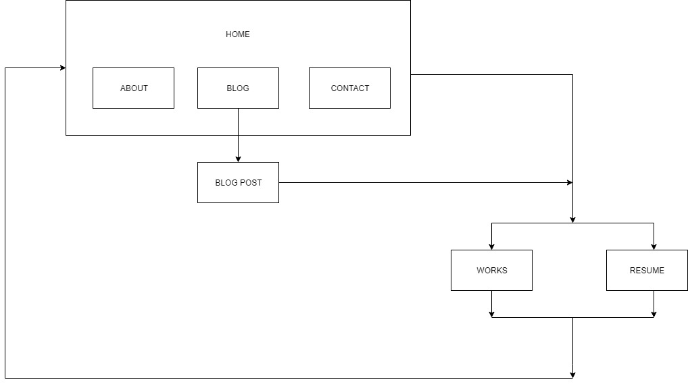
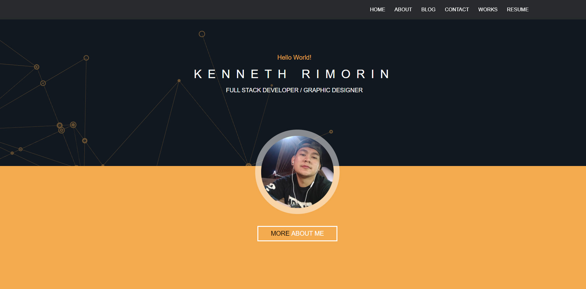
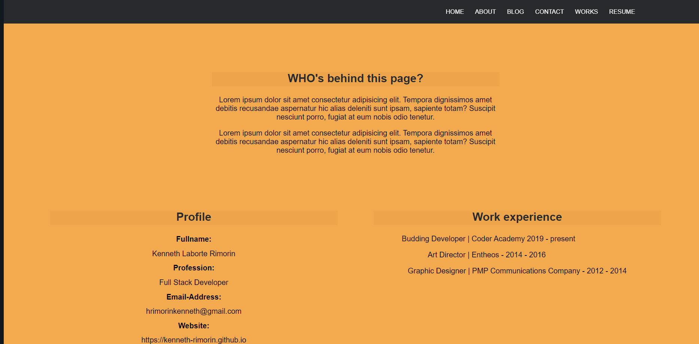
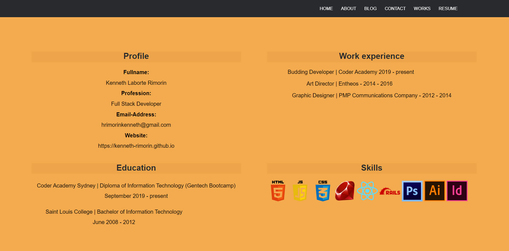
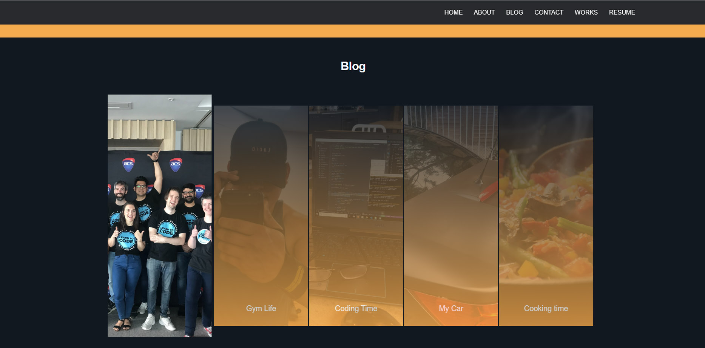
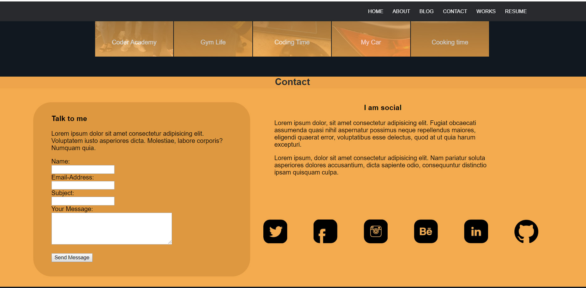
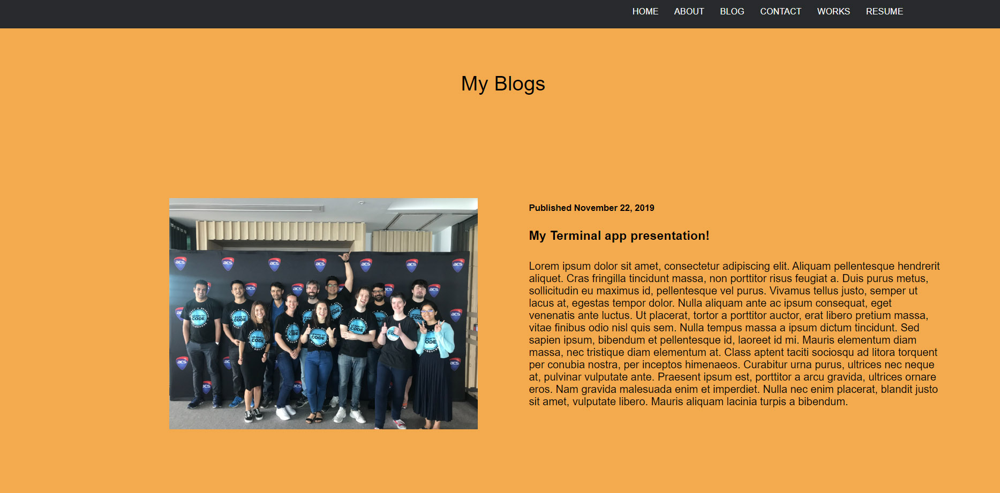
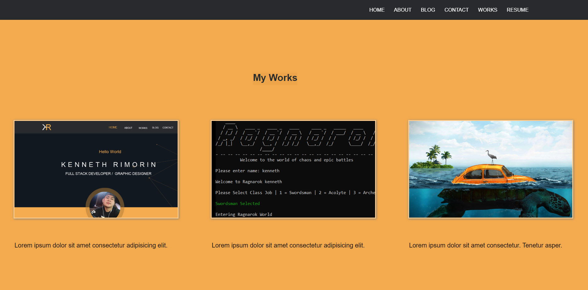
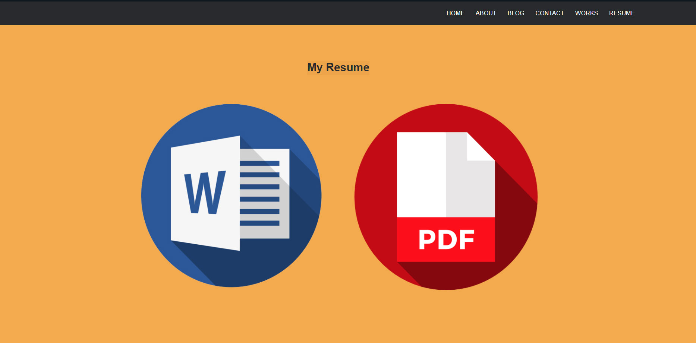

# Kenneth Rimorin's Portfolio

## Links
- Website Portfolio - https://kenneth-rimorin.github.io/

- Github Account - https://github.com/Kenneth-Rimorin

## Purpose
- The purpose of this website build is to present my skills, works and to give a brief description about my personality to potential employers and to the world.

##  Functionality and Features
- Responisve design
- contrasting color scheme
- Animated buttons and images
- Easy-to-read format
- User-friendly navigation
- Understandable labels
- links to my professional accounts and social media

## Sitemap

# Screenshots
- Homepage

- About me

- Blog

- Contact

- Blog Page

- Work Page

- Resume Page

## Target Audience
- The target audience of my website are mainly potential clients and employers. Regardless of the gender, the colours used are neutral which
could also be appealing for the professional adults such as workmates, friends etc.

## Tech Stack
- HTML
- CSS
- SCSS
- Markdown
- Github
- Sha384

